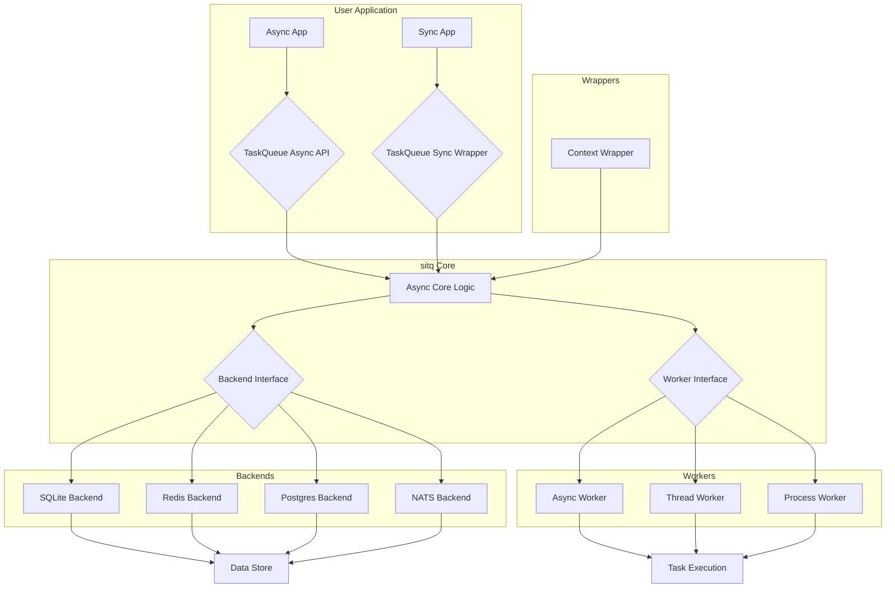

# Refined Architecture for `sitq`

This document outlines the proposed architecture for the `sitq` library, designed to address the critical issues identified in the initial analysis and provide a more robust, extensible, and maintainable foundation for future development.

## 1. Refined Architecture Diagram and Description

The new architecture is built on an **async-first** design, with synchronous operations provided as wrappers around the asynchronous core. This approach allows for efficient, non-blocking I/O and better resource utilization, while still providing a simple, synchronous interface for users who don't need the complexity of async programming.

### Mermaid Diagram

### Key Components

*   **TaskQueue API (Async and Sync)**: The public-facing API for enqueuing tasks and retrieving results. The `TaskQueue` will provide both `async` and synchronous methods, with the synchronous methods acting as wrappers that run the `async` methods in a managed event loop.
*   **Async Core Logic**: The central component that orchestrates the flow of tasks from the `TaskQueue` to the backends and workers. This layer is responsible for serialization, scheduling, and result handling.
*   **Backend Interface**: A well-defined interface that abstracts the details of the underlying data store. This allows for the easy addition of new backends (e.g., RabbitMQ, Kafka) without modifying the core logic.
*   **Worker Interface**: An interface that defines how tasks are executed. Different worker implementations (e.g., `async`, `thread`, `process`) can be used to support various types of workloads.
*   **Context Wrapper**: A mechanism for propagating context (e.g., logging, tracing, dependency injection) from the application to the workers. This will be integrated into the `TaskQueue` and `Worker` interfaces to ensure seamless context propagation.
*   **Data Store**: The underlying persistence layer (e.g., SQLite, Redis, Postgres) that stores tasks and results.
## 2. Key Changes and Improvements

The new architecture will introduce the following key changes and improvements:

*   **Concurrency Model**:
    *   **Async-First Design**: The core of the library will be fully asynchronous, using `asyncio` for non-blocking I/O and improved performance.
    *   **Synchronous Wrappers**: For ease of use, synchronous wrappers will be provided for all public APIs. These wrappers will manage an internal `asyncio` event loop, allowing users to interact with the library in a familiar, synchronous manner.
    *   **Semaphore for Concurrency Control**: The `Worker` will use an `asyncio.Semaphore` to control concurrency, ensuring that the number of active tasks does not exceed the specified limit.

*   **Result Model**:
    *   **Standardized `Result` Object**: The `Result` object will be standardized across all backends and workers, with a clear and consistent structure.
    *   **Improved Error Handling**: The `Result` object will include a detailed `traceback` field for failed tasks, making it easier to debug and diagnose issues.
    *   **Clearer Status Reporting**: The `status` field will be standardized to `pending`, `success`, or `failed`, providing a clear and unambiguous indication of the task's state.

*   **Scheduling**:
    *   **Centralized Scheduling Logic**: The scheduling logic will be centralized in the `TaskQueue`, removing the need for each backend to implement its own scheduling mechanism.
    *   **Timezone-Aware Scheduling**: All `datetime` objects will be timezone-aware, using UTC as the default timezone. This will prevent a wide range of bugs and ensure that scheduled tasks are executed at the correct time, regardless of the user's local timezone.
    *   **Support for `cron`-like Schedules**: The scheduling mechanism will be extended to support `cron`-like schedules, allowing users to define complex, recurring tasks.

*   **Serialization**:
    *   **Pluggable Serializers**: The serialization mechanism will be made pluggable, allowing users to choose the best serializer for their needs (e.g., `pickle`, `json`, `msgpack`).
    *   **Default to `cloudpickle`**: The default serializer will be changed to `cloudpickle`, which provides better support for serializing complex Python objects, including closures and dynamically created classes.

*   **Context Propagation**:
    *   **Seamless Context Propagation**: The `ContextWrapper` will be integrated into the `TaskQueue` and `Worker` interfaces, allowing for the seamless propagation of context (e.g., logging, tracing, dependency injection) from the application to the workers.
## 3. Project Roadmap/Phases

The implementation of the new architecture will be broken down into the following phases:

*   **Phase 1: Core Refactoring**
    *   **Task 1: Async-First Core**: Refactor the `TaskQueue`, `Backend`, and `Worker` to be fully asynchronous.
    *   **Task 2: Synchronous Wrappers**: Implement synchronous wrappers for the `TaskQueue` and other public APIs.
    *   **Task 3: Pluggable Serializers**: Implement the pluggable serialization mechanism and set `cloudpickle` as the default.

*   **Phase 2: Feature Enhancements**
    *   **Task 4: Timezone-Aware Scheduling**: Implement timezone-aware scheduling, with UTC as the default.
    *   **Task 5: `cron`-like Schedules**: Extend the scheduling mechanism to support `cron`-like schedules.
    *   **Task 6: Context Propagation**: Implement the `ContextWrapper` and integrate it into the `TaskQueue` and `Worker` interfaces.

*   **Phase 3: Backend and Worker Improvements**
    *   **Task 7: Backend Refinements**: Refine the existing backends to align with the new architecture and improve their performance and reliability.
    *   **Task 8: Worker Enhancements**: Enhance the existing workers and add new worker types (e.g., a `gevent` worker) as needed.

*   **Phase 4: Documentation and Testing**
    *   **Task 9: Update Documentation**: Update the documentation to reflect the new architecture and APIs.
    *   **Task 10: Comprehensive Testing**: Write comprehensive tests for all new features and refactored code.
## 4. Design Decisions

The following key design decisions have been made to ensure the new architecture is robust, performant, and easy to use:

*   **Async-First Approach**:
    *   **Rationale**: The async-first approach was chosen to maximize performance and scalability. By using `asyncio` at its core, the library can handle a large number of concurrent tasks with minimal overhead. This is particularly important for I/O-bound tasks, where the ability to switch between tasks while waiting for I/O operations to complete can lead to significant performance gains.
    *   **Implementation**: The core components of the library (e.g., `TaskQueue`, `Backend`, `Worker`) will be implemented as `async` classes. Synchronous wrappers will be provided for all public APIs, allowing users to interact with the library in a familiar, synchronous manner.

*   **Synchronous Wrappers for Workers**:
    *   **Rationale**: While the core of the library is asynchronous, many users will want to run synchronous, CPU-bound tasks in the background. To support this, the library will provide synchronous wrappers for the `Worker` class.
    *   **Implementation**: The synchronous wrappers will use a separate thread or process to run the synchronous task, allowing the main `asyncio` event loop to remain unblocked. The `Thread` and `Process` workers will handle the details of running the task in a separate context and communicating the result back to the main event loop.

*   **Pluggable Backends and Serializers**:
    *   **Rationale**: To ensure the library is as flexible and extensible as possible, the backends and serializers will be made pluggable. This will allow users to choose the best components for their needs and easily add new components as required.
    *   **Implementation**: The `Backend` and `Serializer` interfaces will be clearly defined, with a simple registration mechanism for adding new implementations. The library will provide a set of default implementations (e.g., `SQLite`, `Redis`, `cloudpickle`), but users will be free to implement their own.
## 5. Extensibility

The new architecture is designed to be highly extensible, allowing for the easy addition of new backends, worker types, and features.

*   **New Backends**:
    *   **Process**: To add a new backend, you simply need to create a new class that inherits from `Backend` and implements the required methods. The `Backend` interface is well-defined and easy to understand, making it straightforward to add support for new data stores.
    *   **Example**: To add a RabbitMQ backend, you would create a `RabbitMQBackend` class that uses the `aio-pika` library to communicate with a RabbitMQ server.

*   **New Worker Types**:
    *   **Process**: To add a new worker type, you need to create a new class that inherits from `Worker` and implements the `_execute` method. The `Worker` class handles all the details of task processing, so you only need to worry about the specifics of how the task is executed.
    *   **Example**: To add a `gevent` worker, you would create a `GeventWorker` class that uses `gevent` to run the task in a separate greenlet.

*   **New Features**:
    *   **Process**: The new architecture is designed to be modular and easy to extend. To add a new feature, you can create a new component that interacts with the existing components through their well-defined interfaces.
    *   **Example**: To add a task chaining feature, you could create a `Chain` class that takes a list of tasks and enqueues them in sequence. The `Chain` class would use the `TaskQueue` to enqueue the tasks and the `Result` object to determine when each task is complete.