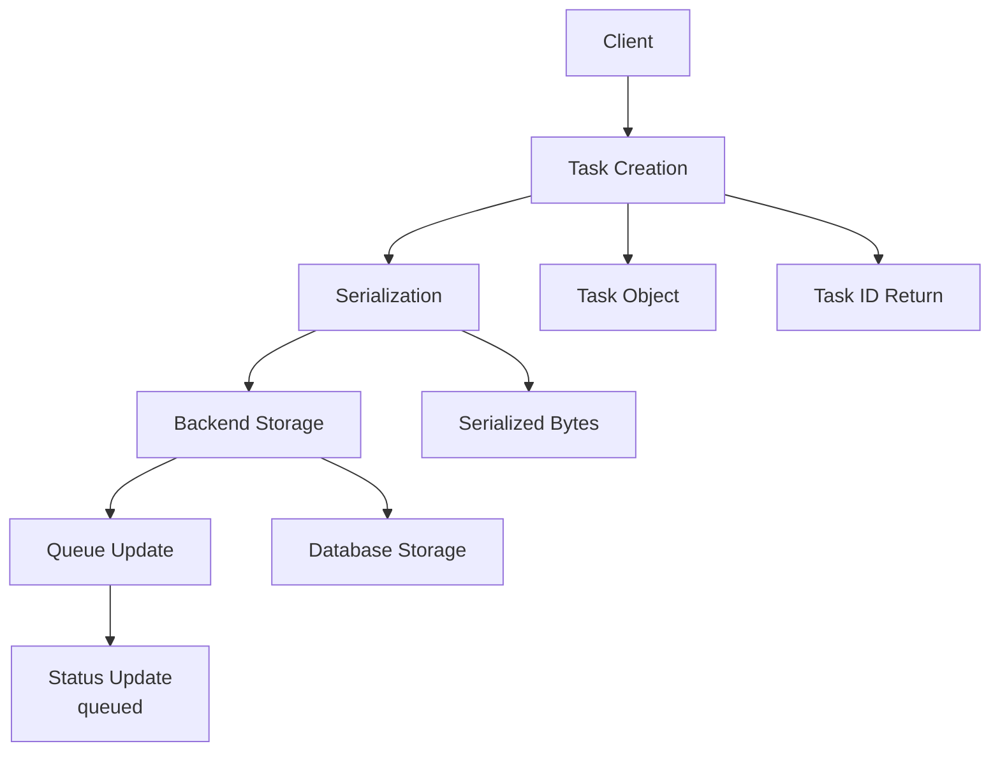
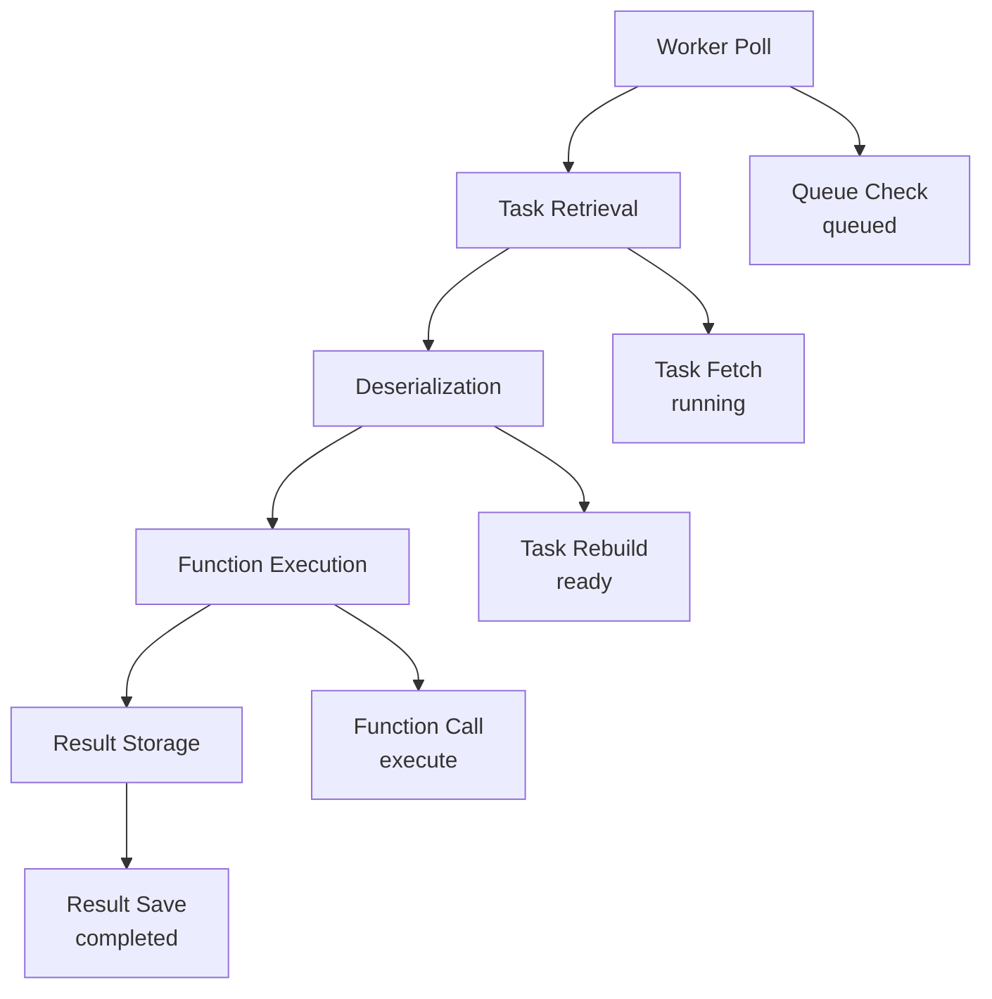
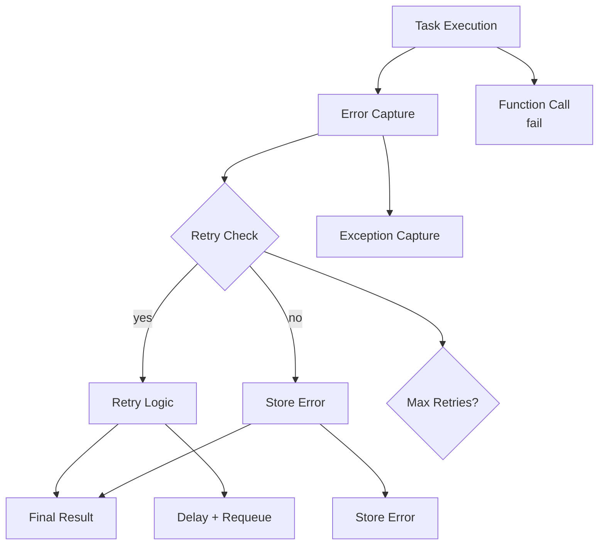
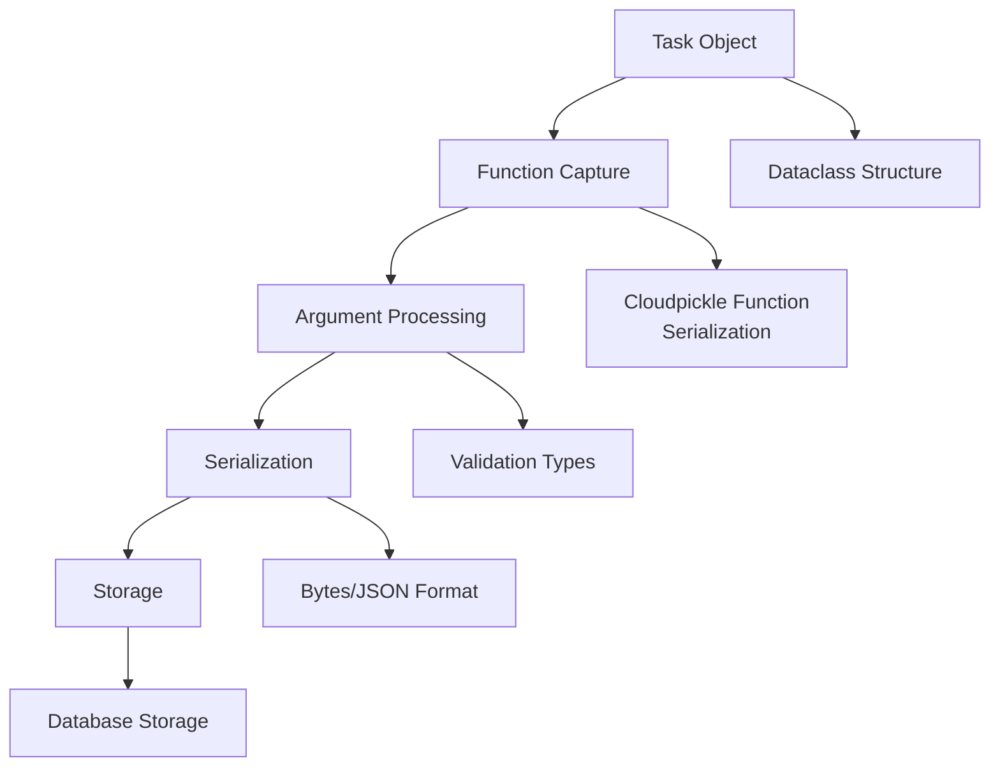
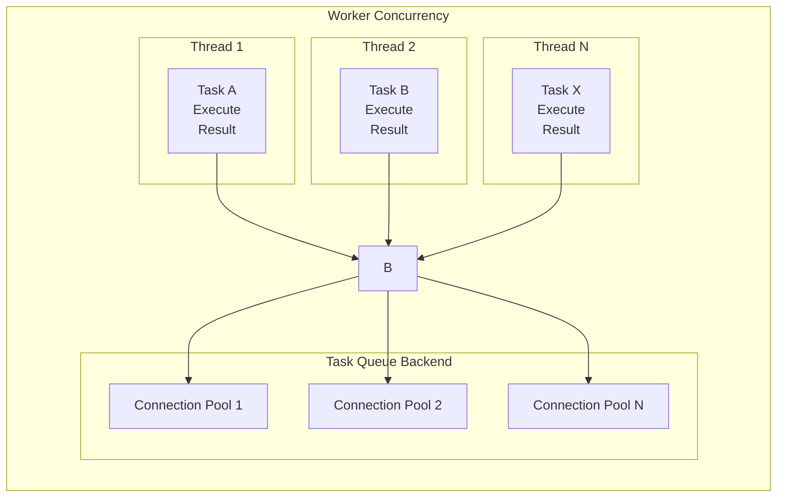
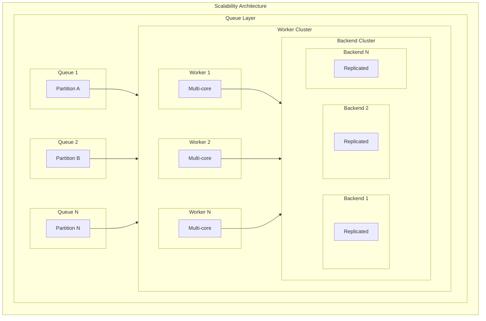

# Architecture

This section provides a deep dive into the sitq architecture, design decisions, and technical implementation details.

## System Architecture Overview

```
┌─────────────────────────────────────────────────────────────────┐
│                        sitq Architecture                        │
├─────────────────────────────────────────────────────────────────┤
│  ┌─────────────┐  ┌─────────────┐  ┌─────────────┐  ┌─────────┐ │
│  │   Client    │  │ Task Queue  │  │   Worker    │  │ Backend │ │
│  │             │  │             │  │             │  │         │ │
│  │ - Task      │◀─│ - Enqueue   │◀─│ - Process   │◀─│ - Store │ │
│  │ - Result    │  │ - Dequeue   │  │ - Execute   │  │ - Query │ │
│  │ - Status    │  │ - Status    │  │ - Retry     │  │ - Index │ │
│  └─────────────┘  └─────────────┘  └─────────────┘  └─────────┘ │
│         │                │                │                │       │
│         └────────────────┼────────────────┼────────────────┘       │
│                          │                │                        │
│  ┌─────────────────────────────────────────────────────────────┐ │
│  │                    Serialization Layer                       │ │
│  │  ┌─────────────┐  ┌─────────────┐  ┌─────────────┐        │ │
│  │  │ Cloudpickle │  │    JSON     │  │   Custom    │        │ │
│  │  │             │  │             │  │             │        │ │
│  │  │ - Default   │  │ - Simple    │  │ - Encrypted │        │ │
│  │  │ - Complex   │  │ - Fast      │  │ - Compressed│        │ │
│  │  │ - Compatible│  │ - Limited   │  │ - Versioned │        │ │
│  │  └─────────────┘  └─────────────┘  └─────────────┘        │ │
│  └─────────────────────────────────────────────────────────────┘ │
└─────────────────────────────────────────────────────────────────┘
```

## Core Components

### 1. Task Model

The task model is the fundamental data structure in sitq:

```python
@dataclass
class Task:
    """Represents a unit of work."""
    id: str
    function: Callable
    args: Tuple[Any, ...]
    kwargs: Dict[str, Any]
    priority: int = 0
    max_retries: int = 0
    retry_delay: float = 0.0
    created_at: float = None
    metadata: Dict[str, Any] = None
```

**Design Decisions:**
- **Immutable ID**: Tasks have unique identifiers that never change
- **Priority Queue**: Lower numbers represent higher priority
- **Retry Logic**: Built-in retry mechanism with exponential backoff
- **Metadata**: Extensible metadata for custom use cases

### 2. Queue Management

The queue manages task lifecycle and ordering:

```python
class TaskQueue:
    """Manages task lifecycle and ordering."""
    
    def enqueue(self, task: Task) -> str:
        """Add task to queue."""
        
    def dequeue(self, worker_id: str = None) -> Optional[Task]:
        """Get next task for processing."""
        
    def get_status(self, task_id: str) -> str:
        """Get task status."""
        
    def get_result(self, task_id: str, timeout: float = None) -> Result:
        """Get task result."""
```

**Queue States:**
- `queued`: Task is waiting to be processed
- `running`: Task is currently being processed
- `completed`: Task finished successfully
- `failed`: Task failed after all retries

### 3. Worker Architecture

Workers execute tasks and handle errors:

```python
class Worker:
    """Executes tasks from the queue."""
    
    def process_task(self, task_id: str) -> Result:
        """Process a single task."""
        
    def run(self, duration: float = None):
        """Run continuously processing tasks."""
        
    def stop(self):
        """Stop worker gracefully."""
```

**Worker Features:**
- **Graceful Shutdown**: Completes current tasks before stopping
- **Error Handling**: Comprehensive error capture and reporting
- **Retry Logic**: Automatic retry with configurable policies
- **Resource Management**: Memory and CPU usage monitoring

### 4. Backend Abstraction

Backends provide persistent storage:

```python
class BaseBackend:
    """Abstract base class for backends."""
    
    def store_task(self, task: Task) -> None:
        """Store task persistently."""
        
    def get_task(self, task_id: str) -> Optional[Task]:
        """Retrieve task by ID."""
        
    def store_result(self, task_id: str, result: Result) -> None:
        """Store task result."""
        
    def get_result(self, task_id: str) -> Optional[Result]:
        """Retrieve task result."""
```

**Backend Types:**
- **SQLite**: Default, file-based, ACID compliant
- **Memory**: In-memory for testing and development
- **Custom**: Extensible for other storage systems

## Data Flow

### Task Submission Flow



### Task Processing Flow



### Error Handling Flow



## Serialization Architecture

### Serialization Pipeline



### Serialization Strategies

1. **Cloudpickle (Default)**
   - Handles complex Python objects
   - Supports lambdas and closures
   - Most compatible option

2. **JSON**
   - Human-readable format
   - Fast serialization
   - Limited to JSON-serializable types

3. **Custom**
   - Application-specific logic
   - Encryption support
   - Compression capabilities

## Concurrency Model

### Worker Concurrency



### Backend Concurrency

- **Connection Pooling**: Multiple database connections
- **Write-Ahead Logging**: Concurrent read/write operations
- **Transaction Isolation**: ACID compliance with proper isolation
- **Lock Management**: Minimal locking for maximum concurrency

## Error Architecture

### Error Hierarchy

```mermaid
classDiagram
    class SitqError {
        <<base exception>>
    }
    
    class TaskError {
        <<task-related errors>>
    }
    
    class TaskNotFoundError
    class TaskTimeoutError
    class TaskSerializationError
    class TaskRetryExhaustedError
    
    class QueueError {
        <<queue-related errors>>
    }
    
    class QueueFullError
    class QueueEmptyError
    class QueueClosedError
    
    class BackendError {
        <<backend-related errors>>
    }
    
    class BackendConnectionError
    class BackendTimeoutError
    class BackendSerializationError
    
    class WorkerError {
        <<worker-related errors>>
    }
    
    class WorkerStoppedError
    class WorkerBusyError
    class WorkerTimeoutError
    
    SitqError <|-- TaskError
    SitqError <|-- QueueError
    SitqError <|-- BackendError
    SitqError <|-- WorkerError
    
    TaskError <|-- TaskNotFoundError
    TaskError <|-- TaskTimeoutError
    TaskError <|-- TaskSerializationError
    TaskError <|-- TaskRetryExhaustedError
    
    QueueError <|-- QueueFullError
    QueueError <|-- QueueEmptyError
    QueueError <|-- QueueClosedError
    
    BackendError <|-- BackendConnectionError
    BackendError <|-- BackendTimeoutError
    BackendError <|-- BackendSerializationError
    
    WorkerError <|-- WorkerStoppedError
    WorkerError <|-- WorkerBusyError
    WorkerError <|-- WorkerTimeoutError
```



### Error Handling Strategy

1. **Prevention**: Input validation and type checking
2. **Detection**: Comprehensive error capture
3. **Recovery**: Retry mechanisms and fallback strategies
4. **Reporting**: Detailed error information and logging
5. **Monitoring**: Error rate tracking and alerting

## Performance Architecture

### Performance Optimizations

1. **Serialization Optimization**
   - Lazy serialization when possible
   - Compression for large objects
   - Caching of serialized data

2. **Database Optimization**
   - Connection pooling
   - Batch operations
   - Index optimization
   - Query optimization

3. **Memory Management**
   - Object pooling
   - Garbage collection tuning
   - Memory limits and monitoring

4. **Concurrency Optimization**
   - Lock-free data structures
   - Async I/O where beneficial
   - CPU affinity for workers

### Scalability Considerations



## Security Architecture

### Security Layers

1. **Authentication**
   - Worker authentication
   - Client authentication
   - API key management

2. **Authorization**
   - Role-based access control
   - Task-level permissions
   - Resource access control

3. **Data Protection**
   - Encryption at rest
   - Encryption in transit
   - Secure serialization

4. **Audit and Logging**
   - Comprehensive audit trails
   - Security event logging
   - Access monitoring

## Monitoring and Observability

### Monitoring Architecture

```mermaid
graph TD
    subgraph M["Monitoring Architecture"]
        direction TB
        
        subgraph Data["Data Collection"]
            direction LR
            subgraph Metrics["Metrics"]
                M1["Counters"]
                M2["Gauges"]
                M3["Histograms"]
            end
            
            subgraph Logs["Logs"]
                L1["Events"]
                L2["Errors"]
                L3["Debug"]
            end
            
            subgraph Traces["Traces"]
                T1["Spans"]
                T2["Context"]
                T3["Timing"]
            end
            
            Metrics --> O
            Logs --> O
            Traces --> O
        end
        
        subgraph O["Observability Stack"]
            direction LR
            subgraph Prom["Prometheus"]
                P["Metrics Storage"]
            end
            
            subgraph ES["Elasticsearch"]
                E["Logs Storage"]
            end
            
            subgraph J["Jaeger"]
                JSt["Tracing Storage"]
            end
            
            P --> V
            E --> V
            JSt --> V
        end
        
        subgraph V["Visualization Layer"]
            direction LR
            subgraph Grafana["Grafana"]
                G1["Dashboards"]
            end
            
            subgraph Kibana["Kibana"]
                K1["Log Search"]
            end
            
            subgraph JUI["Jaeger UI"]
                J1["Trace View"]
            end
        end
    end
```

### Key Metrics

1. **System Metrics**
   - Task throughput
   - Queue depth
   - Worker utilization
   - Error rates

2. **Performance Metrics**
   - Task execution time
   - Queue latency
   - Serialization time
   - Backend query time

3. **Business Metrics**
   - Task success rate
   - Retry frequency
   - Resource consumption
   - Cost per task

## Design Principles

### Core Principles

1. **Simplicity**
   - Minimal API surface
   - Intuitive interfaces
   - Clear separation of concerns

2. **Reliability**
   - Persistent task storage
   - Comprehensive error handling
   - Graceful failure recovery

3. **Performance**
   - Efficient serialization
   - Concurrent processing
   - Minimal overhead

4. **Extensibility**
   - Pluggable backends
   - Custom serialization
   - Flexible worker configuration

5. **Observability**
   - Comprehensive monitoring
   - Detailed logging
   - Performance metrics

### Trade-offs

1. **Simplicity vs. Flexibility**
   - Chose simple API over complex configuration
   - Limited options for better usability

2. **Performance vs. Reliability**
   - Prioritized data consistency over raw speed
   - Used durable storage over in-memory optimization

3. **Features vs. Complexity**
   - Focused on core functionality
   - Avoided feature creep

## Future Architecture

### Planned Enhancements

1. **Distributed Architecture**
   - Multi-node support
   - Consistent hashing
   - Global task distribution

2. **Advanced Scheduling**
   - Cron-like scheduling
   - Task dependencies
   - Resource-aware scheduling

3. **Streaming Support**
   - Real-time task processing
   - Event-driven architecture
   - Stream processing integration

4. **Cloud Native**
   - Kubernetes integration
   - Auto-scaling support
   - Cloud storage backends

## Next Steps

- [Contributing Guide](../how-to/contributing.md) - Learn how to contribute
- [Testing Guide](../how-to/testing.md) - Understand testing strategy
- [Performance Guide](../how-to/performance.md) - Performance optimization
- [API Reference](../reference/api/sitq.md) - Detailed API documentation